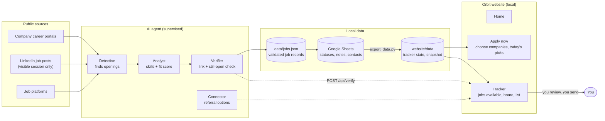

# Job Search AI Agent + Orbit

A human-supervised job-search system: an **AI agent** that finds and verifies openings, and **Orbit**, a local-first website that turns those results into a calm job-search workflow.

**Choose companies (or stay open to any above a pay floor) -> a detective agent hunts career portals, LinkedIn posts and job platforms -> an analyst filters by skills and fit -> a verifier double-checks every link -> your tracker shows Jobs available with referral options beside them.** Orbit drafts notes; you review and send. It never applies or messages for you.

[](website/assets/orbit-promo.mp4)

<sub>Click the preview to watch the 24-second promo ([`website/assets/orbit-promo.mp4`](website/assets/orbit-promo.mp4)). Source, plan and share copy live in [`brag-output/`](brag-output/).</sub>

## Quick start

```bash
cp website/sheets.config.example.json website/sheets.config.json   # add your Google Sheet IDs (git-ignored)
python3 website/export_data.py                                     # builds website/data/dashboard_data.json
python3 website/server.py                                          # http://127.0.0.1:8766/home
```

Pages: **Home**, **Apply now** (choose companies, today's picks) and **Tracker** (Jobs available, board, list). Full details, the sheet status and notes mapping, and the file map are in [`website/README.md`](website/README.md).

Personal data stays local and is git-ignored: your tracker state, the generated snapshot, workbooks, contact lists and `config/profile.json` (copy `config/profile.example.json` to start).

---

## Architecture



### How it fits together

| Layer | What it does | Where it lives |
|---|---|---|
| **AI agent** | Four narrow roles. The *Detective* reads career portals first, then visible LinkedIn posts and public job platforms. The *Analyst* scores each role against the candidate profile and explains why. The *Verifier* opens every link and confirms the opening is real and still live. The *Connector* lines up the HR/TA, alumni and engineer contacts the candidate already added. | `AGENTS.md`, `skills/`, `config/` |
| **Validation** | Every record is normalised to a schema, de-duplicated and checked before it is reported. Third-party listings are marked for verification, and unpublished pay stays `null`. | `config/job.schema.json`, `scripts/validate_jobs.py`, `data/jobs.json` |
| **Sheets as the source of truth** | The agent run and the candidate both write statuses, notes and contacts into Google Sheets. The exporter reads them read-only, understands free text such as "applied on 30/09" or "message sent for referral", reads real job titles from posting pages, and builds one snapshot. | `scripts/export_dashboard_data.py`, `website/export_data.py` |
| **Orbit server** | A small local-only Python server. It serves the pages, stores tracker state in a JSON file, refreshes the snapshot, and runs polite link checks (`POST /api/verify`) for URLs that already exist in the data. | `website/server.py` |
| **Orbit front end** | Plain HTML, CSS and JavaScript with no build step. `app.js` owns routing, data and the company directories. `product.js` adds picks, fit scoring, the board, goals and the command palette. `hunt.js` runs company choice, the hunt pipeline and Jobs available. `home.js` draws the landing page and the agent factory. | `website/` |
| **Promo** | A 24-second video built with Hyperframes from the site's own components, with plan, brief and share copy. | `brag-output/` |

### Request flow in the browser

1. **Choose companies.** The Apply now page lists company blocks with the contacts you already have (HR/TA, alumni, engineers), or you stay open to any company above a minimum pay.
2. **Hunt.** Orbit reads the latest snapshot and scores roles locally with an explainable fit score. The verifier then checks the top links through the local server. Blocked sites are labelled "check it yourself" rather than guessed.
3. **Track.** Roles appear under Tracker as *Jobs available*, with the listing link, tracking details and reach-out options side by side. Statuses and notes you wrote in the sheets show up with a "From your sheet" marker.
4. **Decide.** Orbit drafts a note you can copy and edit. You send it, or apply, yourself.

### Design principles

- **Human in the loop.** Nothing is applied for, sent or messaged automatically, anywhere in the system.
- **Local-first and private.** The server binds to localhost. Tracker state, contacts, sheet IDs and profiles stay on your machine and are git-ignored.
- **Official sources first.** Career pages come before job boards. LinkedIn is read only as listings you can see in your own session; profiles and connection data are never scraped.
- **Honest data.** No salary is ever inferred, scores come with reasons, and every claim keeps its source link.
- **No build tooling.** The site runs from plain files, so it is easy to read, audit and change.

### Repository layout

```
AGENTS.md              operating rules for the AI agent
RUN_SEARCH.md          reusable task prompt for a supervised run
config/                company list, schema, aliases, agent roster, profile example
data/                  validated job records and wave outputs
scripts/               discovery, verification and export tooling
skills/                the job-discovery workflow
website/               Orbit (see website/README.md for the file map)
brag-output/           promo video, plan, brief and Hyperframes composition
```

## Running the AI agent

1. Copy `config/profile.example.json` to `config/profile.json` and fill in the candidate's criteria.
2. Start a supervised run with the prompt in `RUN_SEARCH.md`. The agent searches public career pages and visible listings. When it reaches a login, CAPTCHA or approval step, you take over the browser yourself.
3. Review `data/jobs.json`, then validate it:

```bash
python3 scripts/validate_jobs.py --jobs data/jobs.json
```
